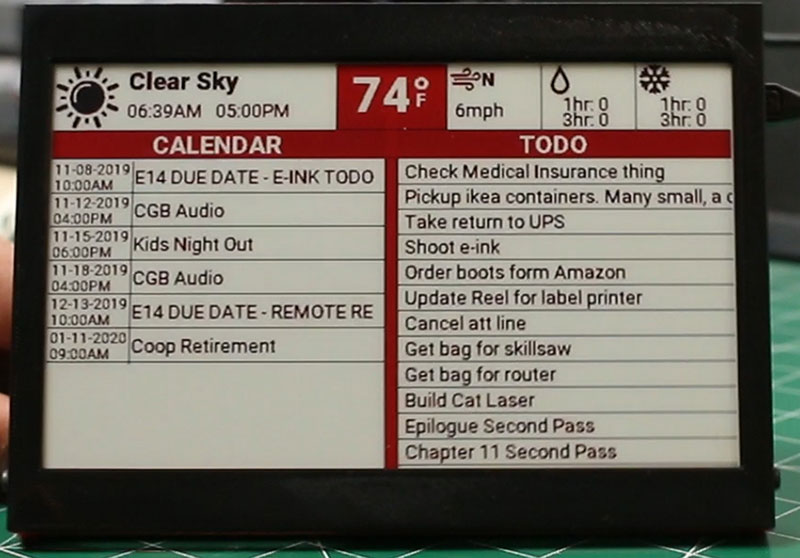

# Infowindow
Rapsberry pi powered e-ink display for displaying information in an always on state. There are several other iterations of this project online, but they didnt do quite what I wanted them to. This is my version. Also keeping up my python skills as they dont get used as much as they used to!

The functionality is not meant to be an "end all solution for calendaring and Todo lists" The intent is to provide an *always  on* display to show me what is coming up next. I can then check in browser, phone, etc for details and updates to the data. In your face reminder.

  <a href="#features">Features</a> |
  <a href="#installation">Installation</a> | 
  <a href="#configuration">Configuration</a> | 
  <a href="#running">Running</a> | 

## Features
* **Calendar**
  * Google Calendar is the only calendar currently supported
* **Todo List**
  * Todoist
  * Teamwork.com
* **Weather**
  * Open Weather Map current data only. Future plan for forecast data.

## Installation
### Get software
Clone this repo onto your raspberry pi. Does not really matter where it is, but good option is in the `pi` users home directory: `/home/pi/InfoWindow`

### Setup python modules
Run `pip install -r requirements.txt`. This should install all required modules. I stuck to basic standard modules for ease of installation.

### Setup drivers for e-ink display.
Insert description of how to setup the e-ink drivers.

## Configuration
You will need to configure a few things such as API Keys and location. This is all done in the `infowindow.py` file near the top. 

## Running
### First Run
You should run the script manually the first time so that Googles auth modules can run interactivly. Once that has completed you will want to add this to CRON so it runs every few minutes automatically.

### Cron Run (Normal use)
Run `crontab -e`
